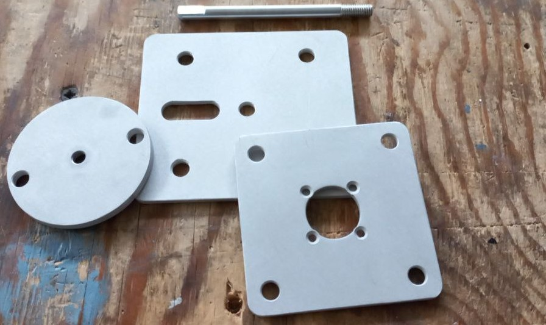

# Airbus OEM TRIM MOTOR

* Main file: `TRIM_MOTOR_v10.step` designed in Fusion 360 

* Took a lot of ideas from: https://soarbywire.com/2019/01/21/trim-wheel-motorization/

## Components:

* Maxon Motor 144650 used (Ebay)
* Huco 273.25.2828 clutch, 6mm hole diameter (RS)
* Vishay 534 10kΩ potentiometer, 6mm shaft (RS)
* Brass Gear 45 Teeths, 6mm hole diameter (Aliexpress https://www.aliexpress.com/item/32843608458.html?spm=a2g0o.order_detail.order_detail_item.4.5f3e4d1aRZIgCr) 
* Brass Gear 34 Teeths, 6mm hole diameter (Aliexpress https://www.aliexpress.com/item/32843608458.html?spm=a2g0o.order_detail.order_detail_item.4.5f3e4d1aRZIgCr)

## CNC Machined Parts:

